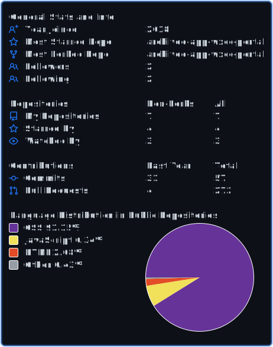

<!-- HEADER -->

  

<h1 align="center"> Tarek Ayadi</h1>
<h3 align="center">Contact Center Architect • CCIE Collaboration • DevNet Specialist • AI Engineer</h3>

______________________________________________________________________

## About Me

I’m a **Contact Center & Collaboration Architect** with **12+ years** building, integrating, and upgrading enterprise CX platforms.\
I specialize in:

- **Cisco Webex, CCE, CVP, CUCM, VVB, Finesse**
- **AI-powered automation, LLM engineering, and full-stack Python/Node development**  
- **Telecom + AI hybrid solutions** for call insights, coaching, real-time alerts & journey orchestration  
- **FastAPI, Hugging Face, React**, and all modern cloud-native tooling  

I take pride in being a **full-stack problem solver** — infrastructure, backend, frontend, AI, automation, customer experience… I build all of it.

______________________________________________________________________

## Certifications

- **CCIE Collaboration**  
- **Cisco DevNet Professional**  
- **AI Architect (LLM Engineering, FastAPI, Hugging Face)**  
- **12 Years Contact Center Engineering**

______________________________________________________________________

## ⚙️ Skills & Technologies

### 🟦 Cisco & Contact Center

`UCCE` · `CVP` · `ICM` · `CUCM` · `VVB` · `Finesse` ·\
`Webex CC` · `Webex Calling` · `SIP` · `Call Routing` · `CVP Microapps`

### 🟩 AI / ML

`LLMs` · `Transformers` · `Hugging Face` · `Embeddings` ·\
`RAG` · `Fine-Tuning` · `Sentiment Analysis` · `Summarization`

### 🟨 Backend

`Python` · `FastAPI` · `Node.js` · `Express` ·\
`REST APIs` · `OpenAI / Cisco GPT APIs`

### 🟧 Frontend & UI

`React` · `Vite` · `Tailwind` · `Dashboards`

### 🟪 Data & Cloud
`PostgreSQL` · `AWS` · `Docker` · `Vercel`

______________________________________________________________________

## Highlight Dev Projects

### 🔹 **Clipboard Manager**
Offline app that helps you manage clipboard history, snippets, secrets and shortcuts.

### 🔹 **FastAPI Call Insights**

LLM-powered call summarization + sentiment + frustration flags.\
Hugging Face inference + FastAPI + export-to-CSV/JSON.

### 🔹 **Smart Call Coaching Tool**

Analyzes transcripts and gives coaching tips, scoring, and agent feedback.

### 🔹 **Agent Alerting System**

Real-time escalation logic + LLM classification + Webex notifications.

### 🔹 **Webex CX Payment portal**
Full backend + frontend system for managing CX cases with AI summaries.

### 🔹 **JDS CaseManager**
Full backend + frontend system for case management system based on JDS Journey Data Services.

______________________________________________________________________

## 📊 GitHub Stats

______________________________________________________________________

## 🤝 Connect With Me

- 🌐 GitHub: **@TarekAyadiDev**
- 💼 LinkedIn: *https://www.linkedin.com/in/tarek-ayadi-0b843721/*  
- 🌎 Miami, FL  

______________________________________________________________________

## 🏴 Final Words

> “I build systems that think, listen, act, and evolve.”\
> — *Tarek Ayadi*
